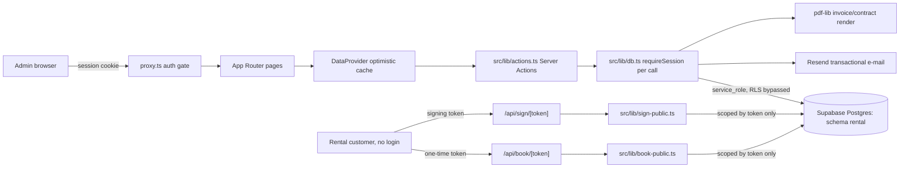

# ARCHITECTURE — map for a stranger (1 page)

<!-- Goal: a senior who has never seen this repo finds the place to change in 15 min. Update on every ADR. -->

**Status: closed 2026, reference/demo** — the business described below is no longer operating.
Everything here describes how the system was actually built and run; see `README.md` for the
current status.

## What this is (3 sentences)

Internal fleet & booking manager for Mountain Car, a small car rental near Keflavík
airport. One admin (single trusted user + optional Google login) runs the whole
business through it — calendar, contracts, invoices, self-service booking links — after
replacing a rented SaaS (RentHelp) that could not be changed on demand. No multi-tenant
concept: one operator, one fleet, one Supabase project.

## Stack (boring, with versions — from package.json)

Next.js 16 (App Router, `next build --webpack` — see `docs/adr/0002-webpack-over-turbopack.md`)
· React 19 · TypeScript 5 (strict) · Tailwind v4 · Supabase (Postgres, schema `rental`,
service-role client — see `docs/adr/0001-supabase-service-role-app-gated.md`) · `date-fns` ·
`pdf-lib` (invoice PDFs) · Resend (transactional e-mail, sent from `db.ts`) · hosting: Vercel
(`git push` deploys — **not** Lovable; edge functions do not exist in this project, everything
runs as Next.js route handlers or Server Actions).

## Modules and boundaries (where things live)

| Path | Responsibility | Entry point | Notes |
|---|---|---|---|
| `proxy.ts` | Edge-safe auth gate (Next "middleware") — verifies the session cookie, redirects to `/login` | `export default function proxy` | Deliberately dependency-free (Turbopack instability, see ADR-0002) |
| `src/lib/auth.ts` | Session cookie: sign/verify (HMAC-SHA256, Web Crypto), fail-closed if `APP_AUTH_SECRET` missing in prod | `createSession`, `verifySession`, `requireSession` | Single-user login (`APP_USER`/`APP_PASSWORD` env) + optional Google ID-token login (`/api/login/google`) |
| `src/lib/supabase-admin.ts` | The only Supabase client in the app — `service_role`, bypasses RLS | `supabaseAdmin` | Server-only (`import "server-only"`); every function that uses it must sit behind `requireSession()` (db.ts) or be scoped by a public token (book-public.ts, sign-public.ts) |
| `src/lib/db.ts` | All authenticated reads/writes (vehicles, customers, bookings, contracts, invoices, checklist, booking links); row↔domain-type mapping; overlap check; triggers e-mail sends | `fetchAll`, `insert*`, `update*`, `delete*` | Functional core for mapping (`toVehicle` etc.); I/O only via `supabaseAdmin` |
| `src/lib/actions.ts` | Next.js Server Actions — the RPC boundary the authenticated UI actually calls (`DataProvider.tsx` and the contracts/customers pages), one thin function per `db.ts` export | `fetchAllAction`, `insert*Action`, `update*Action`, `delete*Action`, `send*EmailAction` | `"use server"`; no logic of its own — every function is a one-line call into `db.ts`, so `requireSession()` still runs there |
| `src/lib/book-public.ts`, `src/lib/sign-public.ts` | The only two paths reachable **without** a session — scoped strictly by a one-time/expiring token from the URL, never exported through `actions.ts` | `getPublicBookingLink`, `submitBookingRequest`, `getPublicContract`, `submitContractSignature` | This is the real authorization boundary for anonymous users (see ADR-0001) |
| `src/lib/contract.ts`, `src/lib/invoice.ts`, `src/lib/invoice-pdf.ts` | Pricing/day-count/VAT rules, rental agreement HTML, invoice numbering and PDF rendering | `invoiceAmounts`, `rentalDays`, `makeNumber`, `buildInvoice` | Pure functions where possible (tested — `invoice.test.ts`); the OWU/legal text lives in `contract.ts` |
| `src/lib/company.ts` | Who operates this rental: the landlord profiles used on contracts and invoices, plus brand, contact details and pickup points | `COMPANIES`, `COMPANY`, `BRAND`, `PICKUP_LOCATIONS`, `kennitalaLabel`, `webLabel` | The only file holding a company name, kennitala or address — `company.test.ts` fails if those details reappear elsewhere in `src/`. Self-hosting = edit this file |
| `src/lib/data.ts` | Synthetic seed data, used only when `NODE_ENV !== "production"` and Supabase env is absent | `vehicles`, `customers`, `bookings` (seed) | Never a fallback in production — `db.ts` throws instead (fail-closed) |
| `src/components/DataProvider.tsx` | Client-side data cache + optimistic updates + rollback-on-error for the authenticated app shell | `useData()` context | Every mutation: optimistic state change → server call → rollback + toast on failure |
| `src/app/*/page.tsx` | One route per nav item (`src/lib/nav.ts`): dashboard, calendar (`/`), bookings, requests, fleet, customers, checklist, contracts, invoices, settings | Next.js file routing | `src/app/book/[token]` and `src/app/sign/[token]` are the two public, unauthenticated routes |
| `src/app/api/*` | Thin route handlers: login (password + Google), public booking submit, public contract sign, live FX rate | Next.js Route Handlers | No business logic here — everything delegates to `src/lib/*` |
| `supabase/migrations/*.sql` | Schema history for the `rental` schema (17 files, `0001_init.sql` onward) | — | Additive/backwards-compatible so far; new HIGH findings tracked in `docs/quality/BACKLOG.md`, not fixed silently |
| `supabase/seed.sql` | Local dev seed (synthetic fleet/customers/bookings) — mirrors `src/lib/data.ts` | — | No real customer data ships in the repo |

## Data flow

## Where is…

- **Authorization**: `proxy.ts` (cookie gate for the whole authenticated app) + `requireSession()`
  at the top of every function in `db.ts`. There is no per-row multi-tenant RLS — this is a
  single-tenant internal tool; the two public routes are scoped by unguessable, expiring tokens
  instead (see `docs/adr/0001-supabase-service-role-app-gated.md`).
- **Pricing / VAT / day-count**: `src/lib/invoice.ts` (`invoiceAmounts`, `rentalDays`) and
  `src/lib/contract.ts` (`isk`, `OWU` contractual fees). Day count is a plain date difference,
  the return day is **not** counted (16→26 = 10 days) — this was a real billing bug, now covered
  by `src/lib/invoice.test.ts`.
- **Contract / OWU (terms) text**: `src/lib/contract.ts` (English + Polish; regulation 840/2015
  expects Icelandic too — flagged, not resolved, in `CHANGELOG.md` 2026-07-31).
- **E-mail sending**: `src/lib/email.ts`, called from `src/lib/db.ts` after a DB write succeeds.
- **Secrets**: `.env.local` locally (see `.env.example`), Vercel project environment variables in
  production. Nothing under `NEXT_PUBLIC_*` that isn't meant to be visible to the browser.
- **Feature flags**: none — the app has no flag system; behaviour changes ship as code.

## Irreversible decisions

See `docs/adr/` — each with the rejected alternative and consequences.

## How to roll back / kill switch

- **Bad deploy**: `git revert <sha> && git push` (Vercel redeploys automatically), or promote the
  previous deployment in the Vercel dashboard. See `docs/RUNBOOK.md`.
- **Compromised session secret**: rotate `APP_AUTH_SECRET` in Vercel — invalidates every existing
  session cookie immediately (HMAC signatures no longer verify).
- **A public booking/sign link leaked**: it expires on its own (60 min for booking links, 14 days
  for signing links); there is no manual revoke endpoint today (`docs/quality/BACKLOG.md`).
