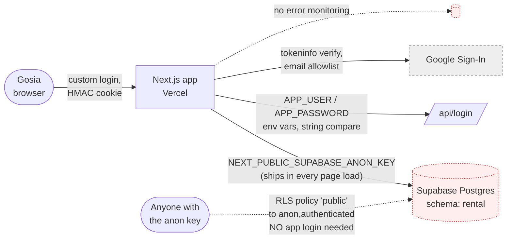

# Architecture audit — rebel-rental — 2026-07-02

Pre-handoff audit before the app goes to Gosia as the daily driver. Mode: AUDIT
(architecture-advisor skill). Findings verified against the live system, not the repo's
tracked migrations — see Finding 1, where the two disagree.

## Context

Solo-built over one long session. Next.js 16 (App Router) + TypeScript + Tailwind, deployed
on Vercel with auto-deploy from `main`. Data lives in Supabase Postgres, project
`mountaincar-is` (shared with the unrelated MAS Warsztat app, isolated in its own `rental`
schema). Auth is a custom HMAC-signed session cookie (single hardcoded admin user) plus
Google Sign-In restricted server-side to that one email. No test suite, no CI beyond Vercel's
build. Real production data already in use: 75 customers, 51 bookings, 12 vehicles, real ISK
amounts and PII (names, phone, email, national ID numbers, driver's license numbers, and now
company NIP).

Team size: one developer (Kamil, assisted by Claude), one end user (Gosia). This context —
tiny team, one real user, real PII, no compliance program — sets the bar for every finding
below: matches the "boring default" (code-first Next.js + Supabase + Vercel, no queue, no
microservices, no custom auth infra) almost exactly. The one place it diverges from safe
practice is Finding 1, and it diverges badly.

## Current-state diagram



`Anyone → DB` is Finding 1: it bypasses `App` and the login page entirely. That arrow
shouldn't exist.

## Findings scorecard

| # | Finding | Type | Severity | Effort | Priority |
|---|---|---|---|---|---|
| 1 | `customers`, `bookings`, `vehicles`, `contracts`, `settings` are readable **and writable** by anyone holding the public anon key — no login required. Live RLS policies grant `{anon, authenticated}`, not just `{authenticated}` as the tracked migration says (prod has drifted from the repo). | Under-eng / risk | **Critical** | Medium | **Do now** |
| 2 | No error monitoring in production. Sentry is the established default and isn't wired. | Under-eng / risk | Medium | Low | Do now |
| 3 | `/api/login` has no rate limiting or lockout; password check is a plain string comparison (not constant-time). Brute-forceable if the fixed admin email is known. | Under-eng / risk | Medium | Low-Medium | Do soon |
| 4 | Session HMAC secret falls back to a hardcoded string (`"dev-insecure-secret-change-me"`) if `APP_AUTH_SECRET` isn't set in the environment. If unset in Vercel prod, anyone can forge a valid session cookie from public source code. | Under-eng / risk | High **if true** | Low (just set the env var) | **Verify now** |
| 5 | No automated test suite, no CI beyond Vercel's build. | (context-dependent) | Low | — | Leave it — correct for a 1-user, 1-dev, manually-QA'd internal tool. Revisit only if a second developer joins. |
| 6 | Modular monolith, single Postgres, no queue/cache/microservices. | OK | — | — | Leave it — exactly the right shape for this scale. |
| 7 | Supabase Pro plan backup/PITR configuration not confirmed from this session — worth a 2-minute dashboard check given real customer data now lives here. | Unverified | Medium if absent | Low (dashboard toggle) | Verify now |

**Severity = pain it causes now. Effort = cost to fix. Priority ≈ severity ÷ effort.**

### How Finding 1 was verified (not asserted from reading the migration file)

The tracked migration (`supabase/migrations/0001_init.sql`) creates `create policy "auth full" ...
to authenticated`. Reading only that file would have missed the problem entirely. Verified instead
against the **live** database:

```sql
select tablename, policyname, roles, cmd, qual from pg_policies where schemaname='rental';
-- customers/bookings/vehicles/contracts/settings: policyname "public", roles {anon,authenticated}, qual: true
-- customer_documents (added this session, still authenticated-only): unaffected
```

Then confirmed end-to-end with the actual public anon key, no session, no login:

```
GET https://cokhsfdxfevqryuhwgjv.supabase.co/rest/v1/customers?select=id,full_name&limit=3
apikey / Authorization: <the same NEXT_PUBLIC_SUPABASE_ANON_KEY the browser bundle ships>
Accept-Profile: rental
→ 200 OK, CF-Cache-Status: DYNAMIC (not cached — live query)
→ [{"full_name":"[klient 378]"}, {"full_name":"[klient 165]"},
    {"full_name":"...ART ATO AGNIESZKA KORYTKOWSKA SPÓŁKA JAWNA (NIP: 1133134467)"}]
```

Negative control, same key, against `customer_documents` (the one table still scoped to
`authenticated` only):

```
POST .../customer_documents  → 401, code 42501,
"new row violates row-level security policy for table \"customer_documents\""
```

The control proves RLS itself works correctly when scoped right — the other five tables were
deliberately (if unintentionally-in-hindsight) opened to `anon`, almost certainly to unblock
the app during development, since the app has never used real Supabase Auth and would have
gotten zero rows otherwise. That decision was never written down and never revisited.

**Impact:** any visitor — no login, no account, just the public key already sitting in
Secrets.md and in every page's JS bundle — can read every customer's name, phone, email,
national ID number, driver's license number, and now company NIP; can read every booking and
its price; and can insert, edit, or delete any row in any of these five tables. This is a live,
currently-exploitable data exposure on real people's PII, on a system about to become someone's
daily business tool.

## ADR-001: Move Supabase data access server-side, gated by the existing session

- **Status:** Proposed
- **Date:** 2026-07-02
- **Context tags:** solo dev · 1 real user · real PII · one-way door (auth/identity + data-access model)

### Context

The app's only real access control is a client-side login page; every actual database read
and write goes straight from the browser to Supabase using the public anon key. RLS was meant
to be the backstop but was loosened to `anon` at some point (undocumented), so today there is
effectively **no server-side enforcement of "must be logged in" at all** — the login page is
cosmetic from the database's point of view.

The app already has the pattern needed to fix this properly: `src/lib/auth.ts` (`verifySession`)
and three existing Route Handlers (`/api/login`, `/api/login/google`, `/api/logout`). There is
no new infrastructure to adopt — just moving where the Supabase calls happen.

### Decision

Move every Supabase read/write currently made from `src/lib/db.ts` (called directly from
client components via `DataProvider`) into server-side code — Next.js Server Actions or a
small set of Route Handlers — that checks `verifySession(cookies().get(AUTH_COOKIE))` before
touching the database. Use the Supabase **service_role** key server-side only (never shipped
to the browser; never put behind `NEXT_PUBLIC_`). Tighten every `rental.*` RLS policy back to
`authenticated`-only (or drop the anon-facing policies entirely, since the browser will no
longer talk to Supabase directly) as defense-in-depth, not as the only line of defense.

### Trade-offs accepted

- Every current `DataProvider` call site (`fetchAll`, `insertBooking`, `updateBooking`,
  `insertCustomer`, etc. — roughly a dozen functions) needs to route through a server boundary
  instead of calling Supabase directly from the browser. This is real, bounded refactor work —
  not a rewrite, but it touches most of the data layer.
- Slightly more latency per request (client → Next.js server → Supabase, instead of client →
  Supabase directly) — irrelevant at this scale (one user, dozens of rows).
- Must ship the RLS tightening **atomically with** the server-side move, not before — flipping
  RLS to `authenticated`-only first, without the server proxy in place yet, takes the live app
  down immediately for Gosia (the browser client would get zero rows).

### Alternatives considered & rejected

- **Wire real Supabase Auth so the browser authenticates as `authenticated`** — rejected here:
  more moving parts (session exchange between the custom cookie and Supabase Auth) for no
  benefit over the server-side approach, given there's exactly one user and the app already has
  a working custom-auth pattern with existing Route Handlers to extend.
- **Leave RLS open, rely on "the anon key isn't advertised"** — rejected: this is what's live
  today and it's the finding, not a mitigation. The key is not a secret; it's shipped in every
  page load by design (that's what `NEXT_PUBLIC_` means).
- **Just tighten RLS back to `authenticated` and stop there** — rejected: breaks the app
  outright, since nothing in the current client ever authenticates as `authenticated`.

### Consequences

Login becomes real again — an unauthenticated visitor gets nothing, not just a locked-looking
UI. The data layer gains one clear boundary (`db.ts`'s functions move from "client fetch
helpers" to "server-only functions"), which also makes a future move to real Supabase Auth (if
a second staff account is ever needed) strictly additive rather than another rewrite.

### Revisit when

- A second logged-in user/role is needed → revisit whether real Supabase Auth is now worth its
  cost (multiple identities makes it earn its keep).
- Traffic or data volume grows enough that the extra server hop becomes measurable — not
  expected at this scale.

## What's next

1. ~~**Confirm Finding 4** (is `APP_AUTH_SECRET` actually set in Vercel prod?)~~ — confirmed set
   locally (`.env.local`); still needs a 2-minute check that Vercel prod has its own value (not
   the same one — see Update below).
2. ~~**Fix Finding 1**~~ — **DONE 2026-07-02, see Update below.**
3. Findings 2, 3, 7 (Sentry, login rate-limiting, Supabase backup/PITR) are cheap, real, but not
   urgent — reasonable to bundle into a follow-up pass.

## Update 2026-07-02: Finding 1 fixed

Implemented ADR-001 as written: `src/lib/db.ts` is now `server-only` and calls
`requireSession()` (new in `src/lib/auth.ts`) at the top of all 13 exported functions;
it talks to Supabase via a new `src/lib/supabase-admin.ts` using the `service_role` key
(`SUPABASE_URL` / `SUPABASE_SERVICE_ROLE_KEY`, server-only env vars, never `NEXT_PUBLIC_`).
A thin `"use server"` layer (`src/lib/actions.ts`) is what client components actually call.
The old client-side `src/lib/supabase.ts` (anon key) is deleted — there is no longer any
Supabase code path reachable from the browser. `proxy.ts` also gained an optimistic session
check so unauthenticated visits to any protected route redirect to `/login` (previously
nothing enforced this at all, page-level).

Verified end-to-end against the real production database before touching RLS:
logged in, confirmed the dashboard renders real data (75 customers) through the new
server-action path, edited a vehicle's notes field and confirmed the write landed in Postgres
via the Management API, then reverted it.

Only then applied the RLS lockdown (`20260702170000_lock_down_rls.sql`): revoked all anon
grants on the `rental` schema and recreated `authenticated`-only policies on all five tables.
Verified the public anon key now gets `401 permission denied for table customers` on a direct
REST call, and re-verified the app still renders real data afterward (service_role bypasses
RLS by design) — so the fix closes the hole without breaking anything.

**Update 2026-07-02 (later same day):** with Kamil's explicit go-ahead, drove his already-
authenticated Vercel dashboard session directly (`claude-in-chrome`) to add `SUPABASE_URL` and
`SUPABASE_SERVICE_ROLE_KEY` as sensitive, Production+Preview env vars, redeployed, and confirmed
"Ready". Also deleted the now-dead `NEXT_PUBLIC_SUPABASE_URL` / `NEXT_PUBLIC_SUPABASE_ANON_KEY`
vars (unused since `src/lib/supabase.ts` was removed) and redeployed again. Confirmed
`APP_AUTH_SECRET` was already set in Vercel prod while there (Finding 4 resolved — not using the
hardcoded fallback). Confirmed the live site now redirects an unauthenticated visit to `/login`
(the new `proxy.ts` gate, deployed). Did not log into the live production site myself — that
still needs a real end-to-end check by Kamil — but since production uses the identical Supabase
project already verified end-to-end locally, and the env vars now match, this should be fully
working. Finding 1 is closed: code fixed, RLS locked down, and the fix is live in production
with the required config in place.

**Still open:**
- Finding 7 (Supabase backup/PITR status) — a 2-minute dashboard check, not done yet.
- Findings 2, 3 (Sentry, login rate-limiting) — cheap, real, not urgent.
- A real end-to-end login test on production by Kamil, to confirm what was verified locally
  holds true live too.
